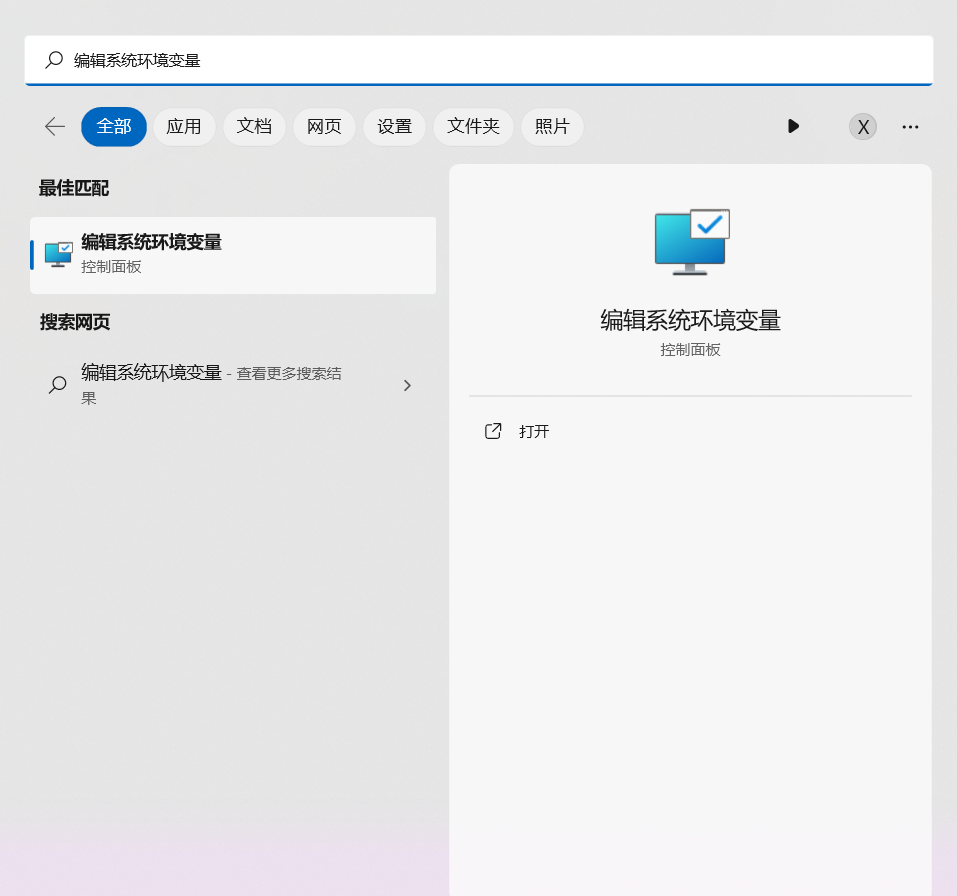
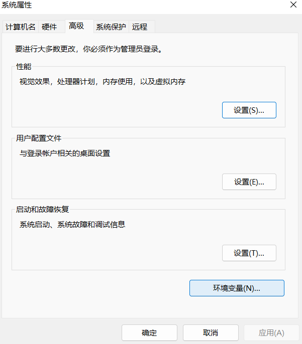
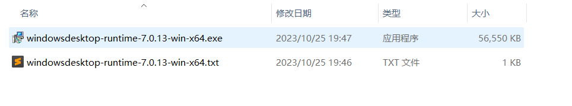
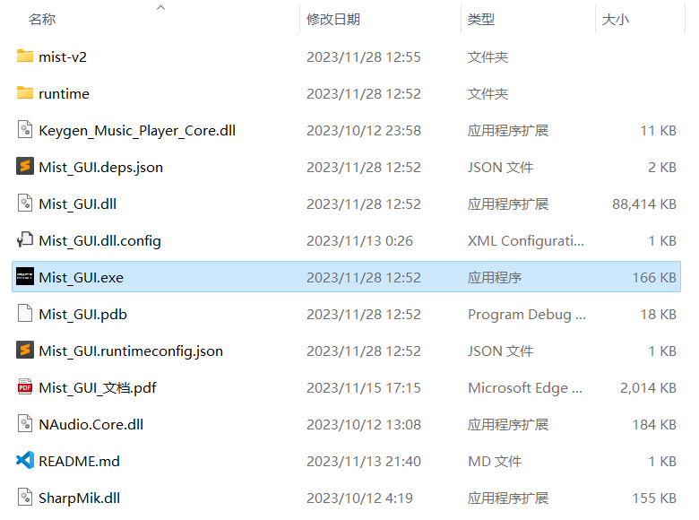
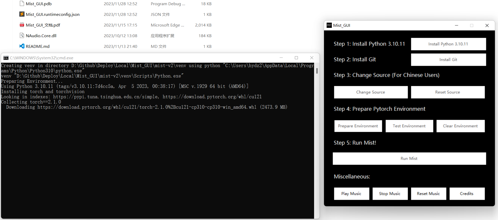
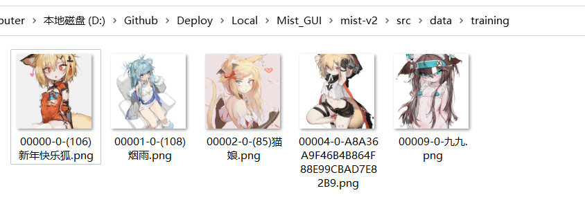
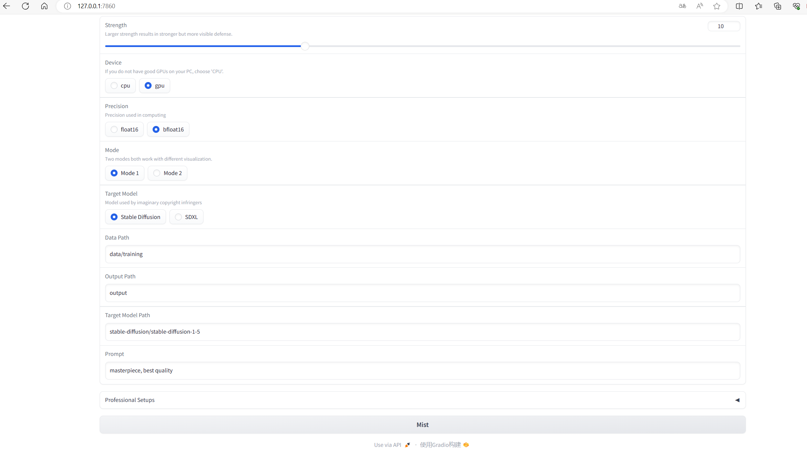

# Mist_GUI使用教程

步骤一：清除你的电脑关于Microsoft应用商店的环境变量

点击开始菜单，并在搜索栏搜索并单击“编辑系统环境变量”



单击后出现以下界面，然后点击“环境变量”：



进入到这个界面，然后双击上方界面的"Path"这一栏：


然后如果列表中含有`C:\Users\xxx(你的用户名)\AppData\Local\Microsoft\WindowsApps`这一项，直接删除即可。


步骤二：安装`Mist_GUI`运行所需的动态库

在整合包中已经包含了`Mist_GUI`运行所需的动态库，在`runtime`文件夹内：



点击`windowsdesktop-runtime-7.0.13-win-x64.exe`进行安装即可。


步骤三：运行`Mist_GUI.exe`

双击项目里的`Mist_GUI.exe`：



然后会弹出以下界面：


步骤四：安装3.10.11版本的python

先去卸载电脑里原有的python（如果有的话），然后点击`Install Python 3.10.11`按钮，会自动弹出python的安装页面，记得勾选`Add Python 3.10 to PATH`，之后点击`Install Now`安装即可：


安装之后记得重启电脑，使得环境变量配置生效。

步骤五：安装Git

点击`Install Git`按钮安装Git即可，Git的安装均按照默认配置。


步骤六：如果是中国用户，则可以选择对pip换源，使得下载依赖包的速度更快

如果要选择换源，点击`Change Source`按钮即可，如果要换回默认的源，点击`Reset Source`按钮即可。


步骤七：准备Pytorch的环境配置

点击`Prepare Environment`按钮，即可进行Pytorch的环境配置。



如果要进行环境测试，点击`Test Environment`按钮即可。

如果出现`Cuda is available: True`的情况，说明该机器是N卡，并且可以使用Cuda进行推理加速。


如果要清除已经配置好的环境，点击`Clear Environment`按钮即可。

步骤八：运行Mist_Webui

完成环境配置之后，点击`Run Mist`即可运行Mist_Webui。


之后使用任意一个浏览器，在地址栏输入`http://127.0.0.1:7860`即可使用Mist_Webui。


步骤九：准备要打上水印的图片，并使用Webui配置和运行Mist

要打上水印的图片默认放在`src/data/training`文件夹，直接把要打上水印的图片放置在该文件夹即可。（示例图已经过原画师授权）



然后按照以下的参数填写：

| 参数 | 值 |
| :-: | :-: |
| Data Path | data/training |
| Output Path | output |
| Target Model Path | stable-diffusion/stable-diffusion-1-5 |
| Prompt | （按照个人喜好填写即可，这里的例子为masterpiece, best quality） |



Strength则代表水印强度和处理步数，数值越高，对ai生成模型的防御功能越强，但对原图像的影响也越大，画师可以根据实际需求进行调整。

对于Device这一项，如果你的电脑是N卡且显存大于等于6GB，则可以使用`gpu`这一项，大大加快处理水印的速度（以RTX 3060为例，Steps=5时，大约1小时5张图），否则使用`cpu`这一项，对显存没有限制但是处理水印的速度相应慢很多（Steps=5时，大约1.5小时处理1张图）。

对于Precision这一项，可以先保持默认选项`bfloat16`，鉴于部分用户的显卡不支持`bfloat16`运算，如果出现报错了切换到`float16`选项即可。

之后点击Webui内的`Mist`这个按钮即可，出现以下信息说明处理成功：


被打上水印的图片放在`src/output`这个文件夹：


注：为了防止配置环境的过程中无聊，特意准备了在软件运行时同时会播放的注册机风格音乐，点击`Stop Music`可以停止播放，点击`Play Music`继续播放，点击`Reset Music`从头开始重新播放，点击`Credits`查看制作人员名单。

# FAQ

Q: 点击相关按钮运行不了，并遇到打开Microsoft应用商店的情况怎么办？

A: 解决方法参见步骤1。

Q: 程序运行时出现以下报错信息，是否会影响使用？

```txt
A matching Triton is not available, some optimizations will not be enabled.
Error caught was: No module named 'triton'
```

A: 这个是由于`xformers`库安装在Windows环境下导致的，直接忽略即可，不会影响Mist的使用。

Q: 如果配置环境过程中出现`No space left on device`怎么办？

A: 这个是由于C盘剩余空间太小导致的，给C盘清理出足够多的空间（大约5GB以上）即可。

Q: 如果点击完`Install Python 3.10.11`按钮再点击`Prepare Environment`按钮出现`Couldn't launch python`错误怎么办？

A: 这是安装完python之后环境变量没有更新导致的，重启电脑再运行`Mist_GUI`即可。